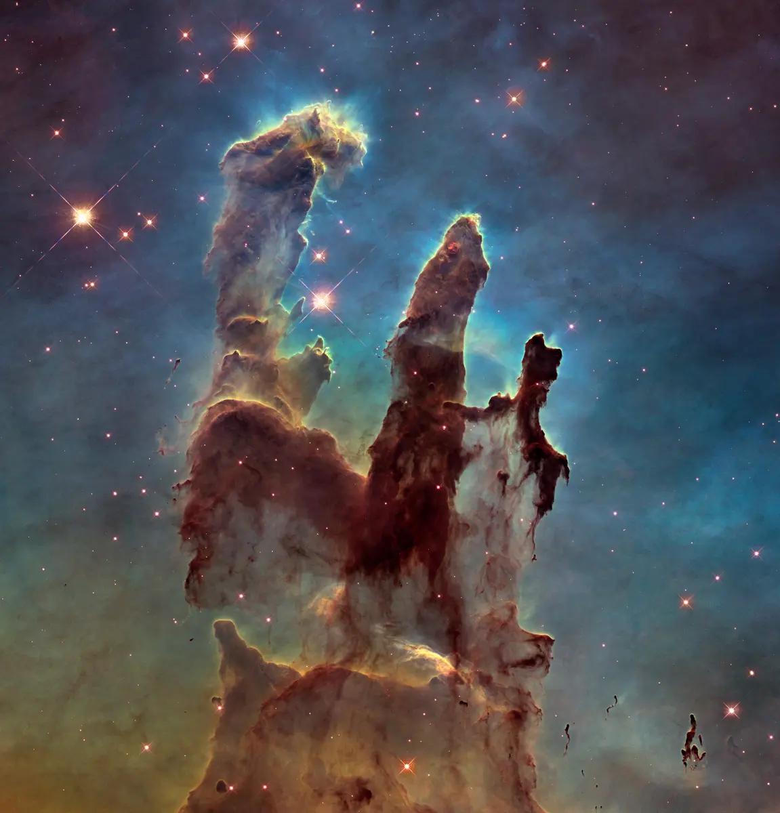

# Project Zenith — The Celestial Eye

> A real-time satellite tracking and space intelligence dashboard built by **Team Phoenix** for **AstralWeb Innovate**, organized by **AARUSH**.



---

## Live Demo

**[team-phoenix-project-zenith.vercel.app](https://team-phoenix-project-zenith-a3bvu74fq-phoenixprojectzenith.vercel.app/)**

---

## Features

| Feature | Description |
|---|---|
| **Live Satellite Map** | Real-time 2D Leaflet map and 3D globe showing satellites overhead your location |
| **ISS Tracker** | Live International Space Station position with pass predictions |
| **Satellite Battles** | Side-by-side orbital comparison of two satellites with 3D visualization |
| **APOD Gallery** | NASA Astronomy Picture of the Day + parallax space image gallery |
| **NEO Tracker** | Near-Earth Object asteroid feed with live close-approach data |
| **Tonight's Report** | Personalized sky report for your location — ISS passes, visible satellites, moon phase |
| **Satellite Lookup** | Search any satellite by name or NORAD ID with orbital telemetry |
| **Pass Countdown** | Next overhead pass predictions for selected satellites |
| **Observer's Journal** | Personal log to record sky observations, persistent per-user |
| **AURA AI Assistant** | Gemini-powered control room AI with real-time telemetry context |
| **Auth** | Google & GitHub sign-in via Firebase Authentication |
| **Settings Panel** | Configure API keys, theme, location, and preferences in-app |
| **Dark / Light Theme** | Full theme toggle with persistent preference |

---

## Tech Stack

| Layer | Technology |
|---|---|
| **Framework** | [Vite](https://vitejs.dev/) + [React 18](https://react.dev/) |
| **3D Globe** | [React Three Fiber](https://docs.pmnd.rs/react-three-fiber) + [Three.js](https://threejs.org/) + [@react-three/drei](https://github.com/pmndrs/drei) |
| **2D Map** | [React Leaflet](https://react-leaflet.js.org/) + [Leaflet.js](https://leafletjs.com/) |
| **Animation** | [Framer Motion](https://www.framer-motion.com/) + [GSAP](https://gsap.com/) + [Lenis](https://lenis.darkroom.engineering/) |
| **Auth** | [Firebase Authentication](https://firebase.google.com/docs/auth) |
| **Orbital Math** | [satellite.js](https://github.com/shashwatak/satellite-js) (SGP4/SDP4 propagation) |
| **Icons** | [Lucide React](https://lucide.dev/) + [Tabler Icons](https://tabler.io/icons) |
| **Routing** | [React Router v7](https://reactrouter.com/) |
| **HTTP** | [Axios](https://axios-http.com/) |
| **Sun/Moon Calc** | [SunCalc](https://github.com/mourner/suncalc) |

---

## API Keys Required

Create a `.env.local` file in the project root with the following variables:

```env
# Firebase (Authentication)
# Get these from: https://console.firebase.google.com → Project Settings → General → Your Apps
VITE_FIREBASE_API_KEY=
VITE_FIREBASE_AUTH_DOMAIN=
VITE_FIREBASE_PROJECT_ID=
VITE_FIREBASE_STORAGE_BUCKET=
VITE_FIREBASE_MESSAGING_SENDER_ID=
VITE_FIREBASE_APP_ID=

# NASA API (APOD + Asteroids/NEO)
# Free key, 1,000 req/hour. Get it at: https://api.nasa.gov
# Falls back to DEMO_KEY (30 req/hour) if not set.
VITE_NASA_API_KEY=

# N2YO (Satellite passes + overhead objects)
# Free tier available. Register at: https://www.n2yo.com/api/
VITE_N2YO_API_KEY=
VITE_N2YO_API_KEY_SECONDARY=   # Optional fallback key

# Google Gemini (AURA AI Assistant)
# Get at: https://aistudio.google.com/app/apikey
# Falls back to simulated Guest Mode if not set.
VITE_GEMINI_API_KEY=

# Astronomy API (Planet/moon positions)
# Register at: https://astronomyapi.com/
VITE_ASTRONOMY_APP_ID=
VITE_ASTRONOMY_APP_SECRET=

# Space-Track (Extended TLE dataset)
# Optional. Register at: https://www.space-track.org/auth/createAccount
# Falls back to CelesTrak (no key needed) if not set.
VITE_SPACETRACK_USER=
VITE_SPACETRACK_PASSWORD=
```

> **Note:** All keys are optional except Firebase (required for auth). The app degrades gracefully — satellite tracking works without N2YO, AI works in Guest Mode without Gemini, etc.

---

## Setup & Local Development

### Prerequisites
- [Node.js](https://nodejs.org/) v18+ and npm

### Steps

```bash
# 1. Clone the repository
git clone https://github.com/sam020607/TeamPhoenix-ProjectZenith.git
cd TeamPhoenix-ProjectZenith

# 2. Install dependencies
npm install

# 3. Create your environment file
cp .env.example .env.local
# Then fill in your API keys in .env.local

# 4. Start the development server
npm run dev
```

Open [http://localhost:5173](http://localhost:5173) in your browser.

---

## Build & Deploy

```bash
# Build for production
npm run build

# Preview the production build locally
npm run preview
```

### Deploying to Vercel

1. Push to GitHub
2. Import repo at [vercel.com/new](https://vercel.com/new)
3. Vercel auto-detects Vite — leave all build settings as default
4. Add all `VITE_*` environment variables in Vercel → Settings → Environment Variables
5. Hit **Deploy**

The included `vercel.json` handles SPA routing and API proxying automatically.

---

## External APIs Used

| API | Purpose | Requires Key | Docs |
|---|---|---|---|
| [CelesTrak](https://celestrak.org/) | TLE satellite data | Free, no key | [celestrak.org](https://celestrak.org/) |
| [N2YO](https://www.n2yo.com/api/) | Pass predictions, overhead sats | Free tier | [n2yo.com/api](https://www.n2yo.com/api/) |
| [NASA API](https://api.nasa.gov/) | APOD, Near-Earth Objects | Free, instant | [api.nasa.gov](https://api.nasa.gov/) |
| [Google Gemini](https://ai.google.dev/) | AURA AI assistant | Free tier | [ai.google.dev](https://ai.google.dev/) |
| [Firebase Auth](https://firebase.google.com/) | Google/GitHub sign-in | Free | [firebase.google.com](https://firebase.google.com/) |
| [AstronomyAPI](https://astronomyapi.com/) | Moon & planet positions | Free tier | [astronomyapi.com](https://astronomyapi.com/) |
| [Space-Track](https://www.space-track.org/) | Extended TLE catalogue | Free account | [space-track.org](https://www.space-track.org/) |

---

## Project Structure

```
src/
├── api/                    # API client modules (NASA, N2YO, CelesTrak, etc.)
├── components/
│   ├── Auth/               # Login / sign-up pages
│   ├── Dashboard/          # Main control room UI + all panels
│   ├── LandingPage/        # Animated landing / home page
│   ├── JournalPanel/       # Observer's journal
│   ├── NightReport/        # Tonight's sky report
│   ├── PassCountdown/      # Satellite pass timer
│   ├── LookUpCard/         # Satellite search & lookup
│   ├── Onboarding/         # First-run briefing flow
│   └── ui/                 # Reusable UI primitives
├── features/
│   ├── satellite-battles/  # Battle mode — orbital comparison
│   └── battle-telemetry/   # Live telemetry for battles
├── hooks/                  # Custom React hooks (ISS, satellites, passes)
├── context/                # Global state (location, theme, satellite store)
├── services/               # Background workers (orbital math Web Worker)
├── utils/                  # Coordinate transforms, formatting helpers
└── firebase.js             # Firebase app initialisation
```

---

## Team Phoenix

| Name | Role |
|---|---|
| Agarim Karnwal | Lead Developer |
| Samriddhi | Full Stack Developer |

---

## License

This project was built for **AstralWeb Innovate**, organized by **AARUSH**. All rights reserved by Team Phoenix.
